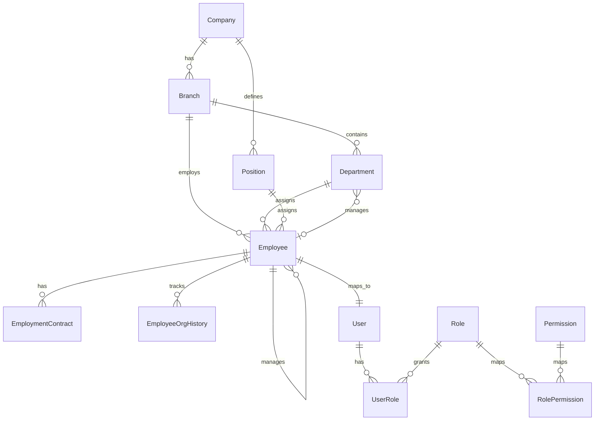
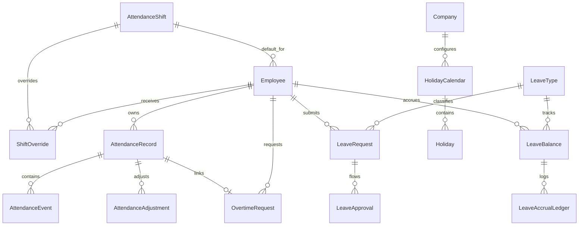
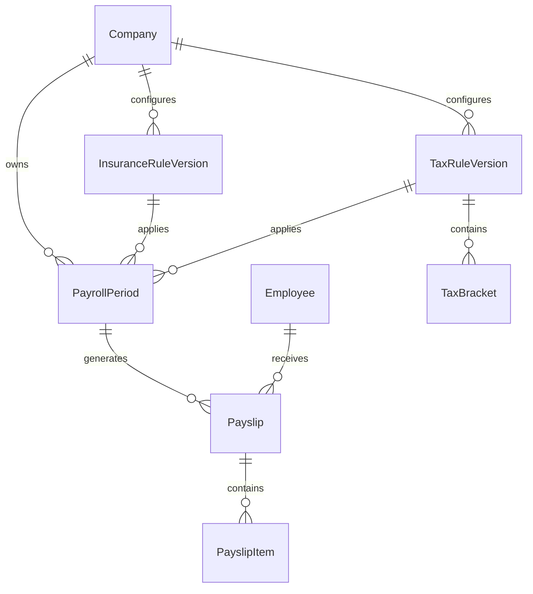
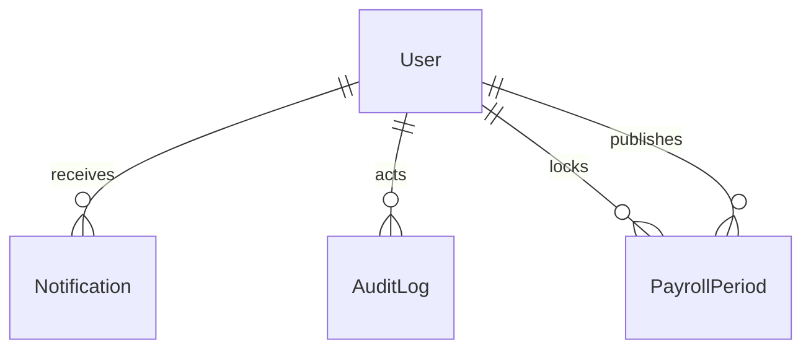

# ERD Phase 1 HRM

## Overview

Tai lieu nay mo ta ERD cho Phase 1 cua HRM, duoc thiet ke tu business rules trong `docs/T01-PHASE1-BUSINESS-RULES.md`.

Muc tieu cua ERD:
- Chot cac entity cot loi cho Phase 1
- Lam ro quan he giua employee, attendance, leave, payroll
- Lam cau noi giua nghiep vu va Prisma schema

## Design Principles

- Dung PostgreSQL + Prisma
- Chuan hoa du lieu cho cac module nghiep vu cot loi
- Giu lich su thay doi quan trong
- Ho tro audit cho cac thao tac nhay cam
- Ho tro versioning cho holiday, insurance, va tax rules
- Chua toi uu cho multi-branch partitioning vi Phase 1 chi co 1 chi nhanh

## Domain ERD

### 1. Organization and Access

### 2. Attendance and Leave

### 3. Payroll and Compliance

### 4. Notifications and Audit

## Core Entities

### Organization
- `Company`: root entity, default timezone and currency
- `Branch`: branch data, currently 1 branch in Ha Noi
- `Department`: org unit, optional manager employee
- `Position`: employee position and level
- `Employee`: master HR profile
- `EmploymentContract`: contract and salary basis
- `EmployeeOrgHistory`: department, position, manager history

### Access Control
- `User`: login identity
- `Role`: role bundle such as Admin, HR, Payroll, Manager, Employee
- `Permission`: granular module/action permission
- `UserRole`: user-role mapping
- `RolePermission`: role-permission mapping

### Attendance
- `AttendanceShift`: working schedule with thresholds
- `ShiftOverride`: per-day shift override
- `AttendanceRecord`: aggregated daily attendance
- `AttendanceEvent`: raw check-in/check-out events
- `AttendanceAdjustment`: HR manual correction trail
- `OvertimeRequest`: OT request and approval record

### Leave
- `LeaveType`: annual leave, unpaid leave, sick leave
- `LeaveBalance`: yearly leave balance snapshot per employee and type
- `LeaveAccrualLedger`: accrual, consumption, adjustment history
- `LeaveRequest`: leave application
- `LeaveApproval`: approval steps

### Payroll
- `PayrollPeriod`: monthly payroll window and lock/publish lifecycle
- `Payslip`: employee payroll summary for one period
- `PayslipItem`: detailed line items
- `InsuranceRuleVersion`: yearly versioned insurance rules
- `TaxRuleVersion`: yearly versioned PIT rules
- `TaxBracket`: tax brackets for a tax rule version

### Support
- `HolidayCalendar`: holiday set by year
- `Holiday`: holiday definitions used by attendance, OT, and payroll
- `Notification`: in-app events
- `AuditLog`: sensitive operation trail

## Key Relationships

### Employee backbone
- Moi `Employee` thuoc 1 `Branch`, 1 `Department`, 1 `Position`
- `Employee` co the tro thanh manager cua nhieu employee khac
- `Employee` co the co `User` de dang nhap, nhung ho so `draft` co the chua co user

### Attendance flow
- `AttendanceRecord` la ban ghi tong hop theo `employee + work_date`
- `AttendanceEvent` luu cac lan check-in/check-out chi tiet
- `AttendanceAdjustment` luu lich su HR sua cong
- `OvertimeRequest` tach rieng de co approval flow va multiplier

### Leave flow
- `LeaveRequest` gan voi `LeaveType`
- `LeaveApproval` cho phep approval step-by-step
- `LeaveBalance` va `LeaveAccrualLedger` giup theo doi cap phep theo nam va theo thang

### Payroll flow
- `PayrollPeriod` tham chieu `InsuranceRuleVersion` va `TaxRuleVersion`
- `Payslip` snapshot tong thu nhap, deduction, tax, insurance
- `PayslipItem` giu tung khoan de export va doi soat

## Data Integrity Rules Reflected in Schema

- `employee_code` unique
- `company_email` unique
- 1 `AttendanceRecord` per `employee + work_date`
- 1 `LeaveBalance` per `employee + leave_type + year`
- 1 `Payslip` per `employee + payroll_period`
- 1 `PayrollPeriod` per `company + year + month`
- 1 `HolidayCalendar` per `company + year`
- Rule versions (`InsuranceRuleVersion`, `TaxRuleVersion`) gan theo nam va ngay hieu luc

## Query-Driven Index Strategy

### Common HR queries
- Employee by department, status, manager
- User by email
- Department by branch

### Attendance queries
- Attendance by employee and date range
- Attendance by work date and status
- OT requests pending approval

### Leave queries
- Leave requests by employee and status
- Team leave approval queue by approver and status
- Leave balances by employee and year

### Payroll queries
- Payslips by employee and payroll period
- Payroll periods by status
- Rule versions by company and year

### Support queries
- Notifications by user and unread status
- Audit logs by entity and date

## Business Rules Not Fully Enforced by Database Alone

Nhung rule sau can xu ly them bang service layer hoac job:
- Leave request khong duoc overlap voi leave da approved
- Attendance deduction quy doi phut sang `0.25 / 0.5 / 1 ngay`
- OT chi tinh sau `18:30`
- OT phai duoc manager approve moi vao payroll
- Attendance khong duoc tao cho nhan vien `terminated`
- Payroll final chi chay khi attendance da chot

## Assumptions Carried Into Schema

- Single branch in Phase 1 nhung van giu bang `Branch` de mo rong
- Holiday co the duoc cau hinh theo nam
- Insurance va tax phai ho tro versioning theo nam
- Payslip co snapshot JSON cho insurance/tax rules de doi soat ve sau
- Holiday half-day chua bi khoa chet trong schema, co the mo rong sau

## Schema Artifact

Prisma schema tuong ung duoc luu tai:
- `backend/prisma/schema.prisma`

## Next Step

Tu ERD nay co the tiep tuc:
1. Tao migration dau tien
2. Sinh Prisma Client
3. Thiet ke API contracts cho `employees`, `attendance`, `leave`, `payroll`
